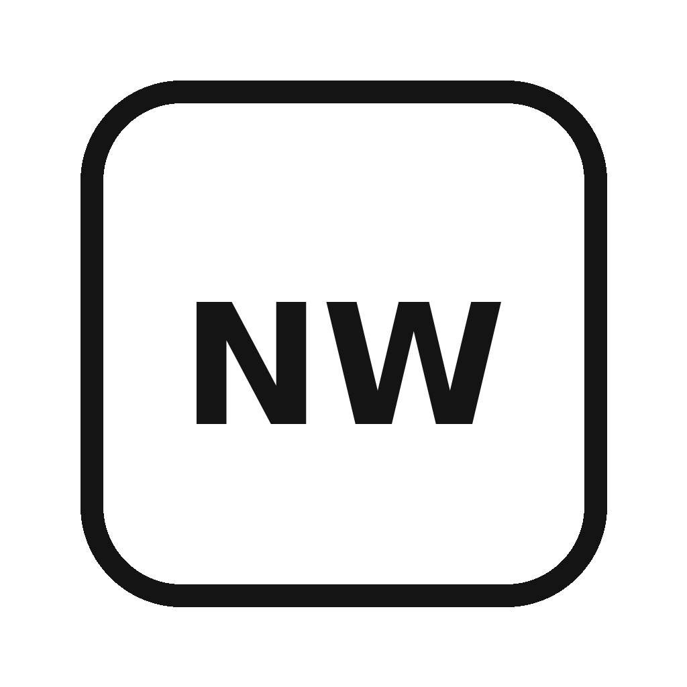

<p align="center">
  
</p>

<h1 align="center">Norcini Workbench</h1>

<p align="center"><strong>A local-first desktop workspace for research, teaching, notes, code, documents, and ideas.</strong></p>

<p align="center">Filesystem + Org + PDFs + LaTeX + notebooks + code + a real Bash terminal.</p>


## Build and install the Mac app

For the normal local release/install workflow:

    npm run install:mac

This packages Norcini Workbench, installs it at:

    /Applications/Norcini Workbench.app

and launches the installed application.

See `RELEASE.md` for the full packaging, backup, code-signing, and release procedure.

## Home screen

Workbench now opens to a real **Home** dashboard inside the application. It is not a static marketing image. The Home button returns to the same dashboard at any time.

The dashboard provides direct entry points to:

- `home.org`, `inbox.org`, and `master.org`
- DAMIC-M, CCD Discovery, IDG, and RXTR Skippers
- the current AS.171.301 teaching directory
- Meetings, Lab Notebook, Reference, and Teaching sections of the Org library
- the real Bash terminal, which remains visible along the bottom

The file tree and dashboard are simply views over the existing filesystem and Org structure. No duplicate Workbench database is created.

## What it is

Norcini Workbench is a lightweight macOS desktop front end over the tools that already hold the real work.

- **Filesystem stays canonical** for projects, code, data, documents, manuscripts, figures, and course material.
- **Org stays canonical** for notes, tasks, projects, meetings, logs, and navigation.
- **Zotero stays canonical** for papers and bibliographic metadata.
- **DokuWiki stays useful** for group-facing durable knowledge.
- **Workbench does not create a new database.**

The aim is simple: make the existing academic workflow easier to navigate without replacing the underlying tools.

## Current desktop experience

- GitHub-inspired light interface
- file navigator over real local folders
- rendered Org and Markdown as the primary reading view
- optional Quick Edit with conflict protection
- clickable Org TODO/DONE states and checkboxes
- internal Org/file links open inside Workbench
- PDF preview
- Python, R, shell, LaTeX, and notebook actions
- real `/bin/bash -l` PTY terminal using `node-pty` and xterm
- Tab completion, shell history, Ctrl-C, interactive CLI programs
- **Terminal here** for the selected file or folder
- live filesystem refresh
- resizable panes
- native macOS application name and NW Dock icon

## Install the macOS app

The simplest route is the included **`INSTALL.command`**.

1. Unzip this folder somewhere permanent, for example `~/Documents/tools/norcini-workbench`.
2. Double-click `INSTALL.command`.
3. The script installs dependencies, rebuilds `node-pty`, runs `npm audit`, and builds `Norcini Workbench.app`.
4. When prompted, allow it to copy the app to `/Applications`.

Because the app is not code-signed or notarized yet, macOS may require **right-click → Open** the first time.

### Terminal equivalent

```bash
npm install
npm audit
npm run pack:mac
```

Then copy the generated `Norcini Workbench.app` from `dist/` into `/Applications`.

For a shareable DMG and ZIP build:

```bash
npm run dist:mac
```

## Development launch

```bash
npm install
npm start
```

The development build also sets the NW Dock icon so it does not present as generic Electron while testing on macOS.

## Local roots

Workbench currently exposes these real locations:

```text
~/org
~/Documents/hopkins
~/Documents
~/Desktop/inbox
```

No project files are copied into Workbench. The sidebar is a navigator over the filesystem.

## Terminal architecture

The embedded terminal is not a fake command box. It is a real Bash pseudo-terminal:

```text
Electron main process
       │
       ├── node-pty
       │      └── /bin/bash -l
       │
       └── IPC bridge
              └── xterm renderer
```

This is why ordinary shell behavior works, including Tab completion, history, `ssh`, REPLs, `emacs -nw`, Ctrl-C, and other interactive programs.

## Source-of-truth philosophy

Workbench is intentionally a **navigator + viewer + launcher + lightweight editor**.

It is not intended to become the place where research data, notes, references, or project metadata have to be migrated. The design is local-first, reversible, and understandable.

## Documentation

- [`ARCHITECTURE.md`](ARCHITECTURE.md) — application structure and major architectural choices
- [`DEPENDENCIES.md`](DEPENDENCIES.md) — runtime and build dependencies
- [`REBUILD.md`](REBUILD.md) — reconstruct the application on a clean Mac
- [`DEVELOPMENT.md`](DEVELOPMENT.md) — development workflow
- [`CHANGELOG.md`](CHANGELOG.md) — version history
- [`AI_INTEGRATION.md`](AI_INTEGRATION.md) — future optional AI boundary

## Version

Current packaged source baseline: **0.8.1**.

This release preserves the stable Electron 0.7.4 PTY architecture while adding the 0.8 light desktop interface, current Electron security refresh, macOS branding, build packaging, and rebuild documentation.

## Future AI

AI is deliberately **not** fundamental to the Workbench architecture. A future optional layer may receive explicit context such as the open file, selected text, project folder, Org tasks, terminal output, Zotero references, or a local search result. The filesystem, Org, and Zotero remain the sources of truth.
